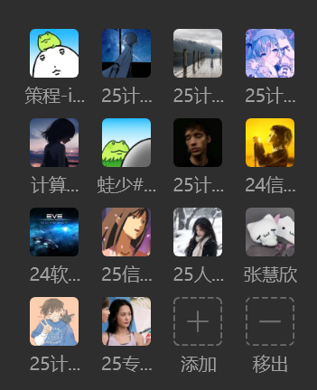

好的，没问题！

我们把复杂的规范都去掉，换成一个更简洁、更酷、更适合 Game Jam 氛围的版本。我已经帮你添加了图片和徽章，让它看起来更引人注目。

直接复制下面的所有内容到你的 `README.md` 文件里就行了！

---

# 🎮 GameOff Game Jam - [在这里写上你的游戏酷炫名称] 🚀

*`
`👆 记得把这张图片换成我们游戏最帅的截图或 Logo 哦！`
`*

欢迎来到我们的 **GitHub Game Off** 大本营！这里是我们用最新的 **Unity 6** 引擎挥洒创意、引爆灵感的阵地。准备好，一场好戏即将上演！

---

## 📜 关于游戏 (About The Game)

> 在这里简单介绍一下我们的游戏是什么，有什么好玩的。
>
> 比如：这是一款像素风的平台跳跃游戏，你将扮演一只会时间回溯的赛博朋克猫，在霓虹闪烁的城市里揭开一个惊天大秘密...

---

## ✨ **协作三步曲 (3 Simple Rules)** ✨

忘掉复杂的流程，记住这三点就够了！

### **1. 开工前，先“同步”！🔄**

* 动手之前，记得先 **Fetch** 和 **Pull**，确保你的版本是最新鲜的，避免“穿越”作战！

### **2. 开发时，常“保存”！💾**

* 完成一个小功能就 **Commit** 一次，像玩游戏存档一样，给你的辛勤劳动一个安全的记录点。

### **3. 上传时，说“人话”！✍️**

* **Push** 之前，请在提交信息里写清楚你干了啥，比如“修复了玩家卡墙的Bug”或“添加了超酷的爆炸特效”。**拒绝使用“1”、“aaa”这种火星文！**

---

## 🧑‍💻 **开发团队 (The Dream Team)** 🧑‍💻

* **[你的名字]** - [你的角色，比如：主程序 / 灵魂画师]
* **[队友的名字]** - [队友的角色，比如：关卡设计师 / 音效大师]
* *(可以继续添加更多成员)
  *
